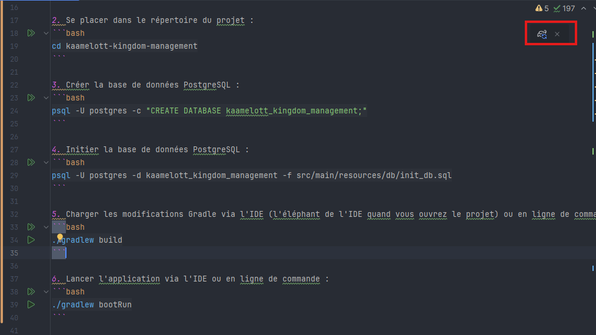
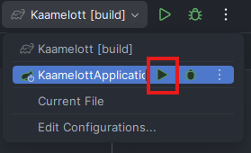

# La Gestion du Royaume de Kaamelott

## Installation

### Prérequis
- Java 19
- PostgreSQL + Variable d'environnement `PATH` pointant vers le répertoire `bin` de PostgreSQL. Exemple :
  - Sous Windows : `C:\Program Files\PostgreSQL\16\bin`

### Installation de l'application

1. Cloner le dépôt :
```bash
git clone https://github.com/Titouan-C/kaamelott-kingdom-management.git
```

2. Se placer dans le répertoire du projet :
```bash
cd kaamelott-kingdom-management
```

3. Créer la base de données PostgreSQL :
```bash
psql -U postgres -c "CREATE DATABASE kaamelott_kingdom_management WITH OWNER postgres ENCODING 'UTF8' TEMPLATE template0;"
```

4. Initier la base de données PostgreSQL :
```bash
psql -U postgres -d kaamelott_kingdom_management -f src/main/resources/db/init_db.sql
```

5. Changer le mot de passe de la base de donnée PostgreSQL dans le fichier `.env`.

6. Charger les modifications Gradle via l'IDE (l'éléphant de l'IDE quand vous ouvrez le projet) ou en ligne de commande :
```bash
./gradlew build
```


7. Lancer l'application via l'IDE ou en ligne de commande :
```bash
./gradlew bootRun
```


8. Acccéder aux requêtes via l'URL [http://localhost:3001/swagger-ui.html](http://localhost:3001/swagger-ui.html)


## Choix techniques du projet

### 1. SGBD : PostgreSQL
**Pourquoi ce choix ?**
- PostgreSQL est un SGBD open-source robuste, très utilisé en entreprise, avec un excellent support des types de
données, des contraintes d'intégrité, et des transactions.
- Il offre de bonnes perfomances et une grande compatibilité avec Spring Data JPA / Hibernate.
- Utilisation des UUID pour les identifiants, ce qui permet une meilleure scalabilité et évite les problèmes de
séquences dans les bases de données distribuées.
**Alternative** : MySQL ou MariaDB, mais PostgreSQL est préféré pour ses fonctionnalités avancées

### 2. Lombok
**Pourquoi ce choix ?**
- Lombok est une bibliothèque Java qui permet de réduire le boilerplate code en générant automatiquement les getters,
setters, constructeurs, etc. Ca rend le code plus lisible et maintenable.
**Alternative** : Faire les getters/setters manuellement, mais cela alourdit le code.

### 3. Validation des entrées (Bean Validation via annotations)
**Pourquoi ce choix ?** 
- Utilisation des annotations de validation (comme @NotNull, @Size, etc.) sur les entités pour garantir l'intégrité
des données en entrée.
**Alternative** : Validation manuelle dans le code, mais cela rend le code moins maintenable et plus sujet aux erreurs.

### 5. Documentation API : Swagger + Documentation manuelle (README.md)
**Pourquoi ce choix ?**
- Swagger permet de générer automatiquement une documentation interactive de l'API REST, facilitant la compréhension.
- La documentation manuelle (README.md) permet de fournir des informations détaillées sur l'installation, la
configuration et les choix techniques du projet.
**Alternative** : Uniquement manuelle, mais cela serait moins interactif et plus difficile à maintenir.

### 6. Gestion des exceptions : BaseException + hierarchie d'exceptions
**Pourquoi ce choix ?**
- Création d'une classe de base `BaseException` pour centraliser la gestion des exceptions et faciliter la maintenance.
- Héritage pour des cas métiers (par exemple ConflictException, NotFoundException) pour une meilleure lisibilité et
compréhension des erreurs.
**Alternative** : Gestion des exceptions sans hiérarchie, mais cela rendrait le code plus verbeux et moins clair.

### 7. Structure du projet : par feature
**Pourquoi ce choix ?**
- Organisation du code par fonctionnalité (feature) plutôt que par couche (controller, service, repository) pour mieux
séparer les responsabilités et faciliter la navigation dans le code.
- Exemple : `src/main/java/com/example/kaamelott/feature/chevaliers/controller/ChevalierController.java`,
`src/main/java/com/example/kaamelott/feature/chevaliers/services/ChevalierService.java`,
`src/main/java/com/example/kaamelott/feature/quetes/repository/QueteRepository.java`, etc.
**Alternative** : Organisation par couche, mais cela rendrait le code plus difficile à naviguer et à maintenir (surtout
si le projet grandit).

### 8. Enums
**Pourquoi ce choix ?**
- Utilisation d'énumérations Java quand le nombre de valeurs est faible et stable (meilleur performance, simplicité).
- Possibilité d'utiliser des tables en base si besoin de rendre dynamique (nottament pour les titres des chevaliers,
qui peuvent être modifiés dans le temps).
**Alternative** : Utiliser des constantes, mais cela rendrait le code moins lisible et plus sujet aux erreurs.

### 9. Suppression soft
**Pourquoi ce choix ?**
- On ne supprime jamais vraiment une donnée pour garder l'historique, mais on la marque comme inactive (grâce à un champ
`deleted_at` nullable).
- Cela implique de filtrer les données supprimées dans les requêtes pour ne pas les afficher. Ainsi, j'ai créé un
repository générique `BaseRepository` qui étend `JpaRepository` et ajoute les méthodes pour gérer la suppression
soft (on ne récupère pas les entités supprimées).
**Alternative** : Suppression physique, mais cela rendrait impossible la récupération des données supprimées.

### 10. Pagination
**Pourquoi ce choix ?**
- Utilisation de la pagination pour les listes d'entités (par exemple, les quêtes, les chevaliers) pour éviter de
charger trop de données en mémoire et améliorer les performances (même avec peu de données).
**Alternative** : Pas de pagination, mais cela pourrait entraîner des problèmes de performance et de mémoire si le
nombre d'entités augmente dans le futur.

### 11. Gestion des dépendances : Gradle
**Pourquoi ce choix ?**
- C'est un outil de build moderne et performant.
- Sa syntaxe est plus lisible que celle de Maven, et il permet une meilleure gestion des dépendances.
**Alternative** : Maven (solution historique et stable), mais Gradle est préféré pour sa flexibilité et sa rapidité.

### 12. Récupération des données
**Pourquoi ce choix ?**
- Utilisation de `@Query` pour les requêtes complexes pour améliorer les performances et la lisibilité du code =>
  permet de directement récupérer les données nécessaires à l'application sans avoir à modifier le modèle de données.
- Utilisation de `@Transactional` pour les méthodes qui modifient la base de données pour garantir l'intégrité des
données et éviter les problèmes de concurrence.
**Alternative** : Utilisation de méthodes de repository standards, mais cela rendrait le code moins performant et plus
complexe.

## Contrats d'interface

### 0. Réponse générique

```json
{
  "ok": "booléen indiquant si la requête a réussi",
  "data": {
    // Données spécifiques à la requête
  },
  "message": "Message d'information ou d'erreur"
}
```

### 1. GET /chevaliers

Récupère la liste des chevaliers avec pagination.

#### Requête
```http
GET /chevaliers?page=0&limit=10
```

#### Réponse

Pour toutes les requêtes, la réponse est structurée de la manière suivante :
```json
{
  "ok": true,
  "data": {
    "content": [
      {
        "id": "UUID",
        "nom": "Nom du chevalier",
        "titre": "Titre du chevalier",
        "caracteristique_principale": "GOURMAND",
        "niveau_bravoure": 1
      }
    ],
    "nextCursor": null
  },
  "message": "Chevaliers récupérés avec succès"
}
```

#### 2. POST /chevaliers

Crée un nouveau chevalier.

#### Requête
```http
POST /chevaliers
```

#### Corps de la requête
```json
{
  "nom": "Nom du chevalier",
  "titre": "Nom du titre",
  "caracteristique_principale": "GOURMAND",
  "niveau_bravoure": 5
}
```

#### Réponse
```json
{
  "ok": true,
  "data": {
    "id": "UUID",
    "nom": "Nom du chevalier",
    "titre": "Titre du chevalier",
    "caracteristique_principale": "GOURMAND",
    "niveau_bravoure": 1
  },
  "message": "Chevalier créé avec succès"
}
```

#### 3. GET /quetes/{id}/participants

Récupère la liste des participants à une quête avec leur rôle et leur statut dans la quête, avec pagination.

#### Requête
```http
GET /quetes/{id}/participants?page=0&limit=10
```

#### Réponse
```json
{
  "ok": true,
  "data": {
    "content": [
      {
        "id": "UUID du chevalier",
        "nom": "Nom du chevalier",
        "role": "Chef de quête",
        "statut": "En cours"
      }
    ],
    "nextCursor": null
  },
  "message": "Participants récupérés avec succès"
}
```

#### 4. POST /quetes/{idQuete}/assigner-chevalier

Assigne un chevalier à une quête.

#### Requête
```http
POST /quetes/{idQuete}/assigner-chevalier
```

#### Corps de la requête
```json
{
  "id_chevalier": "UUID du chevalier",
  "role": "Chef de quête",
  "statut": "En cours"
}
```

#### Réponse
```json
{
  "ok": true,
  "data": null,
  "message": "Chevalier assigné à la quête avec succès"
}
```

#### 5. GET /chevaliers/{idChevalier}/quetes-en-cours

Récupère la liste des quêtes en cours pour un chevalier avec pagination.

#### Requête
```http
GET /chevaliers/{idChevalier}/quetes-en-cours?page=0&limit=10
```

#### Réponse
```json
{
  "ok": true,
  "data": {
    "content": [
      {
        "quete_id": "UUID de la quête",
        "quete_nom": "Nom de la quête",
        "participation_statut": "En cours"
      }
    ],
    "nextCursor": null
  },
  "message": "Quêtes en cours récupérées avec succès"
}
```

#### 6. GET /quetes/difficulte-aberrante

Récupère la liste des quêtes non commencées avec une difficulté aberrante avec pagination.

#### Choix technique :
- Ajout d'un statut de participation `"Non commencée"` pour les quêtes qui n'ont pas encore été commencées par les
chevaliers.
- Ajout d'une méthode `getFinishedStatues()` dans l'énumération `StatutParticipation` pour récupérer les statuts
qui sont considérés comme terminés (par exemple, `"Terminée"`, `"Abandonnée par flemme"`, etc) => ça permet de
filtrer la requête SQL pour ne pas récupérer les quêtes qui ont déjà été commencées.

#### Requête
```http
GET /quetes/difficulte-aberrante?page=0&limit=10
```

#### Réponse
```json
{
  "ok": true,
  "data": {
    "content": [
      {
        "id": "UUID de la quête",
        "nom": "Nom de la quête",
        "description": "Description de la quête",
        "difficulte": "Aberrante",
        "date_assignation": "2023-10-01",
        "date_echeance": "2023-10-15"
      }
    ],
    "nextCursor": null
  },
  "message": "Quêtes avec difficulté aberrante récupérées avec succès"
}
```

#### 7. GET /chevaliers/{idChevalier}/retirer-quete/{idQuete}

Retire un chevalier d'une quête.

#### Requête
```http
GET /chevaliers/{idChevalier}/retirer-quete/{idQuete}
```

#### Réponse
```json
{
  "ok": true,
  "data": null,
  "message": "Chevalier retiré de la quête avec succès"
}
```
#### 8. GET /chevaliers/caracteristique/{caracteristique}

Recherche les chevaliers par caractéristique principale avec pagination.

#### Requête
```http
GET /chevaliers/caracteristique/{caracteristique}?page=0&limit=10
```

#### Réponse

```json
{
  "ok": true,
  "data": {
    "content": [
      {
        "id": "UUID du chevalier",
        "nom": "Nom du chevalier",
        "titre": "Titre du chevalier",
        "caracteristique_principale": "GOURMAND",
        "niveau_bravoure": 1
      }
    ],
    "nextCursor": null
  },
  "message": "Chevaliers par caractéristique récupérés avec succès"
}
```

#### 9. GET /quetes/effectif-manquant?minChevaliers={min}

Retourne les quêtes qui ont un nombre de chevaliers assignés inférieur à un minimum donné avec pagination.

#### Requête
```http
GET /quetes/effectif-manquant?minChevaliers=3&page=0&limit=10
```

#### Réponse
```json
{
  "ok": true,
  "data": {
    "content": [
      {
        "id": "UUID de la quête",
        "nom": "Nom de la quête",
        "description": "Description de la quête",
        "difficulte": "Normale",
        "date_assignation": "2023-10-01",
        "date_echeance": "2023-10-15",
        "effectif_actuel": 2
      }
    ],
    "nextCursor": null
  },
  "message": "Quêtes avec effectif manquant récupérées avec succès"
}
```

#### 10. GET /quetes/les-plus-longues?limit={nombre}

Retourne les quêtes les plus longues (en jours) avec pagination. Les quêtes sont triées par durée décroissante.

#### Requête
```http
GET /quetes/les-plus-longues?page=0&limit=10
```

#### Réponse
```json
{
  "ok": true,
  "data": {
    "content": [
      {
        "id": "UUID de la quête",
        "nom": "Nom de la quête",
        "description": "Description de la quête",
        "difficulte": "Difficile",
        "date_assignation": "2023-09-01",
        "date_echeance": "2023-10-01"
      }
    ],
    "nextCursor": null
  },
  "message": "Quêtes les plus longues récupérées avec succès"
}
```

#### 11. GET /quetes/periode?date_debut={date1}&date_fin={date2}

Retourne les quêtes qui ont été assignées dans une période donnée avec pagination.

#### Requête
```http
GET /quetes/periode?date_debut=2023-10-01&date_fin=2023-10-31&page=0&limit=10
```

#### Réponse
```json
{
  "ok": true,
  "data": {
    "content": [
      {
        "id": "UUID de la quête",
        "nom": "Nom de la quête",
        "nb_chevaliers": 5,
        "statut": "En cours",
        "difficulte": "Normale",
        "duree_totale": "10 jours"
      }
    ],
    "nextCursor": null
  },
  "message": "Quêtes dans la période récupérées avec succès"
}
```

#### 12. GET /chevaliers/rapport-performance/{idChevalier}

Retourne un rapport de performance d'un chevalier, incluant le nombre de quêtes terminées, le nombre de quêtes en étant
chef d'expédition et le taux de succès (terminée / en_cours + terminée).

#### Requête
```http
GET /chevaliers/rapport-performance/{idChevalier}
```

#### Réponse
```json
{
  "ok": true,
  "data": {
    "id_chevalier": "UUID du chevalier",
    "nom_chevalier": "Nom du chevalier",
    "nb_quetes_terminees": 10,
    "nb_quetes_en_cours": 5,
    "nb_quetes_total": 15,
    "taux_succes": 66.67,
    "commentaire_du_roi": "Excellent travail, continuez ainsi !"
  },
  "message": "Rapport de performance récupéré avec succès"
}
```

#### 13. GET /stats/rapport-activite-mensuel?mois={mois}&annee={annee}

Retourne un rapport d'activité mensuel, incluant le nombre total de nouvelles quêtes, le nombre totale de quêtes
terminées, le nombre de chevaliers ayant participé à au moins une quête, et la quête la plus lamentablement échouée.

#### Requête
```http
GET /stats/rapport-activite-mensuel?mois=10&annee=2023
```

#### Réponse
```json
{
  "ok": true,
  "data": {
    "mois": "Octobre 2023",
    "nb_nouvelles_quetes": 20,
    "nb_quetes_terminees": 15,
    "nb_chevaliers_participants": 10,
    "quete_plus_lamentablement_echouee": {
      "id": "UUID de la quête",
      "nom": "Nom de la quête",
      "description": "Description de la quête",
      "difficulte": "Difficile",
      "date_assignation": "2023-10-01",
      "date_echeance": "2023-10-15"
    }
  },
  "message": "Rapport d'activité mensuel récupéré avec succès"
}
```

#### 14. DELETE /chevaliers/{id}

Supprime un chevalier (soft delete).

#### Requête
```http
DELETE /chevaliers/{id}
```

#### Réponse
```json
{
  "ok": true,
  "data": null,
  "message": "Chevalier supprimé avec succès"
}
```

### 15. GET /chevaliers/titres

Récupère la liste des titres de chevaliers.

#### Requête
```http
GET /chevaliers/titres
```

#### Réponse
```json
{
  "ok": true,
  "data": {
    "titres": [
      {
        "id": "UUID du titre",
        "nom": "Nom du titre"
      }
    ]
  },
  "message": "Titres récupérés avec succès"
}
```